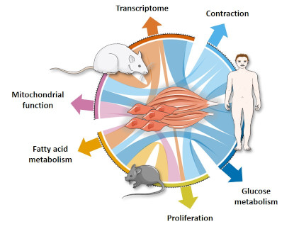

Comparative profiling of skeletal muscle models reveals heterogeneity of transcriptome and metabolism
================
Ahmed M. Abdelmoez, Laura Sardón Puig, Jonathon A. Smith, Brendan M. Gabriel, Mladen Savikj, Lucile Dollet, Alexander V. Chibalin, Anna Krook, Juleen R. Zierath and Nicolas J. Pillon
Link to publication and DOI

Rat L6, mouse C2C12 and primary human skeletal muscle cells (HSMC) are commonly used to study biological processes in skeletal muscle and experimental data on these models is abundant. However, consistently-matched experimental data are scarce and comparisons between the different cell-types and adult tissue are problematic. We hypothesized that metabolic differences between these cellular models may be reflected at the mRNA level. Publicly available data were used to profile mRNA levels in myotubes and skeletal muscle tissues. L6, C2C12 and HSMC myotubes were then assessed for proliferation, glucose uptake, mitochondrial activity, substrate oxidation and response to in vitro contraction. Transcriptomic profiling revealed that mRNA of genes coding for actin and myosin were more abundant in C2C12, whereas L6 myotubes had the highest levels of glucose transporters and genes encoding the 5 complexes of the mitochondrial electron transport chain. Consistently, insulin-stimulated glucose uptake and oxidative capacity were greatest in L6 myotubes. Insulin-induced glycogen synthesis was highest in HSMC, but C2C12 myotubes had higher baseline glucose oxidation. All models responded similarly to electrical pulse stimulation-induced glucose uptake. qPCR. Our analysis reveals a great degree of heterogeneity in the transcriptomic and metabolic profiles of L6, C2C12 or human primary cells. Based on these distinct signatures, we provide recommendations for the appropriate use of these models depending on scientific hypotheses and biological relevance.

